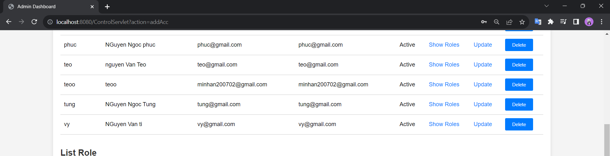

# Web quản lý tài khoản

Web Quản lý Tài khoản là một ứng dụng servlet Java, cho phép bạn quản lý tài khoản, quyền truy cập và ghi log trong hệ thống. Web sử dụng cơ sở dữ liệu để lưu trữ thông tin về tài khoản, quyền truy cập và log đăng nhập/đăng xuất

## Cài đặt

Để chạy web, bạn cần có môi trường sau:

- MariaDB
- Một máy chủ web (ví dụ: Apac Tomcat).
- Môi trường java JDK 17

### Cài đặt MariaDB

1. Tải và cài đặt MariaDB hoặc MySQL từ [https://mariadb.org/download/](https://mariadb.org/download/).

2. Đăng nhập vào MariaDBbằng tài khoản root và tạo một tài khoản với tên "sa" và mật khẩu "sapsword". Sử dụng các lệnh SQL sau:
   CREATE USER 'sa'@'localhost' IDENTIFIED BY 'sapsword';
   GRANT ALL PRIVILEGES ON . TO 'sa'@'localhost' WITH GRANT OPTION;
   FLUSH PRIVILEGES.

### Cài đặt Apache Tomcat

1. Đảm bảo bạn đã cài đặt máy chủ ứng dụng servlet như Apache Tomcat trên máy chủ web của bạn.Có thể tại ở đây (https://tomcat.apache.org/download-10.cgi)

2. Triển khai mã nguồn của ứng dụng lên máy chủ ứng dụng servlet. Đảm bảo tệp WAR của ứng dụng được đặt trong thư mục webapps của Apache Tomcat..Xem hướng đẫn (https://www.jetbrains.com/idea/guide/tutorials/working-with-apache-tomcat/using-existing-application/)

### Cài đặt Java 17

1. Cài đặt môi trường java cho ứng dụng (Đề nghị dùng JDK 17),Có thể tải ở đây (https://www.oracle.com/java/technologies/javase/jdk17-archive-downloads.html)

2. Setup môi trường java.(https://www3.cs.stonybrook.edu/~amione/CSE114_Course/materials/resources/InstallingJava17.pdf)

### Start Project 
1. Chạy file scriptDB trong script Folder  

2. Setup tomcat để run Project  

3. Start Project 

4. Web hiển thị trang đăng nhập 

    
5. Đăng nhập tài khoản để truy cập web

    Nếu là tài khoản bình thường không phải là admin thì Web sẽ hiển thị thông tin của tài khoản và các quyền 

    Nếu là tài khoản admin thì trang sẽ hiển thị trang admin cho phép người dụng xem thông tin và thực hiện các thao tác quản lý tài khoản(Tài khoản Admin mặc định (TK:an,MK:123)):  

6. Có thể xem các Role của một Account bằng cách click vào Show Role Trong table Account 

7. Có thể xem các Account của một Role Bằng cách click vào Show Account trong Table Rolw 

8. Phân quyền bằng cách nhấn vào Nút Permisson Trong màn hình Dashboard  

9. Sau khi nhấn vào nút Permisson web sẽ đưa tới trang permission hiển thị các quyền đang được phân cho User 

10. Chọn nút Add Grant để phần quyền cho user 

11. Hiển thị màn hình phân quyền. Ở đây bạn có thể phân quyền cho các user vào các role có trong CSDL
    
    Nếu phân quyền thành công bạn sẽ được đưa về trang Permission với dòng thông báo ADD Grant Success .... 

    Nếu phân quyền không thành công bạn sẽ được nhận thông báo 

12. Để xem thông tin của các phiên đăng nhập vào web bạn có thể nhấn vào Button Logs Trong DashBoard 

13. Có thể thực hiện update Account , Role , Logs , Grant bằng cách nhấn vào phần update trong các Table tương ứng (các thông tin trong phần update sẽ được hiển thị tương ứng với thông tin của đối tượng cần update)

    Màn hình update Accout(Phần ID sẽ không được chỉnh sửa) 
    Phần update sẽ được cập nhật ở Dashboard 

    Màn hình update Role(Phần ID sẽ không được chỉnh sửa) 
    
    Màn hình update Grant (Phần Role_id và Account_id không được chỉnh sửa) 
    
    Màn hình update Logs (Phần Account_id,Time login,Time logout sẽ không được chỉnh sửa) 

14. Có thể thực hiện delete Account, Role, Logs, Grant bằng cách nhấn vào button Delete Trong các Table tương ứng

    Delete Account (sẽ set Status thành Delete) 

    Delete Role (sẽ set Status thành Disable) 

    Delete Grant (sẽ set Status thành Disable) 

    Delete Logs (sẽ set Note thành Remove) 

15. Thực hiện Add các đối tượng qua việc nhấn nút Add ở từng bảng (trừ Logs sẽ được tự thêm vào mỗi lần logout)

    Add Account  sau đó màn hình sẽ được chuyển về dashboard và thêm Account mới vào bảng 

    Add Role  sau đó màn hình sẽ được chuyển về dashboard và thêm Role mới vào bảng 
    
    Add Grant (xem phần 11.)

16. Bấm logout để rời khỏi trang web (phiên đăng nhạp sẽ được lưu vào Logs) 

